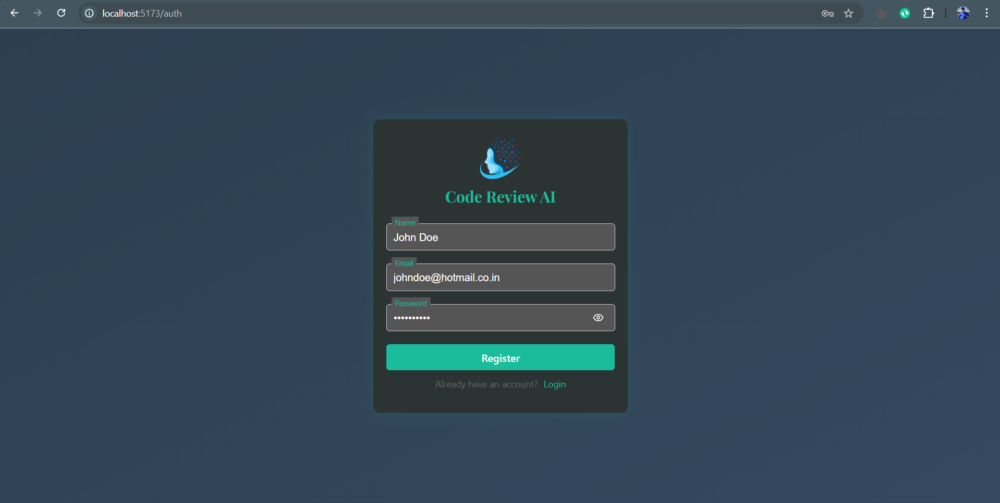
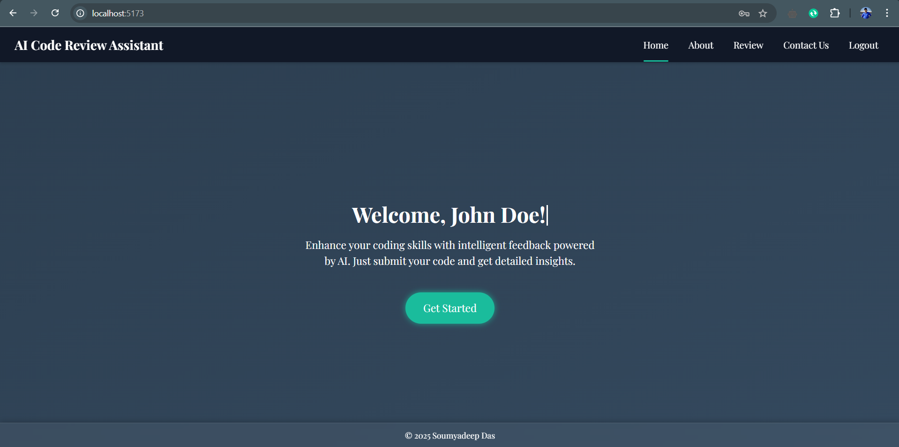
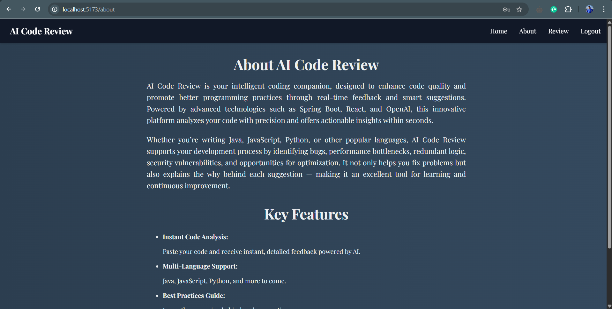
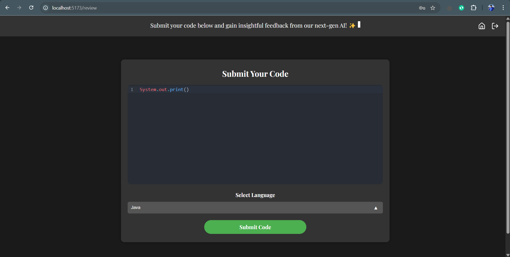
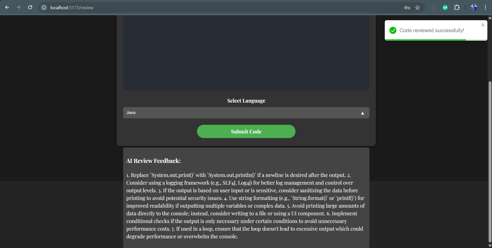
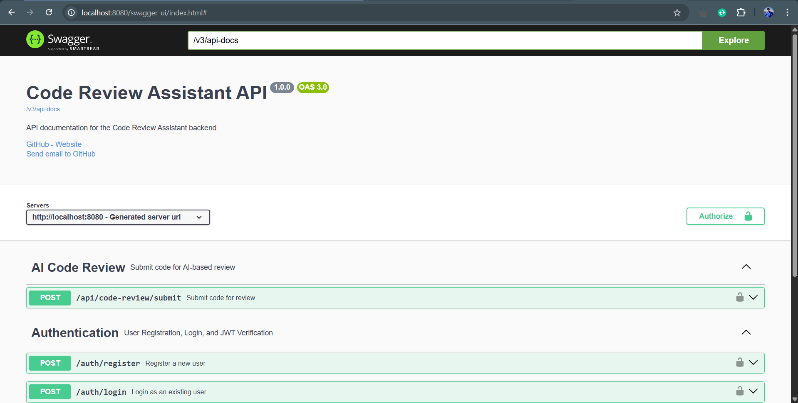
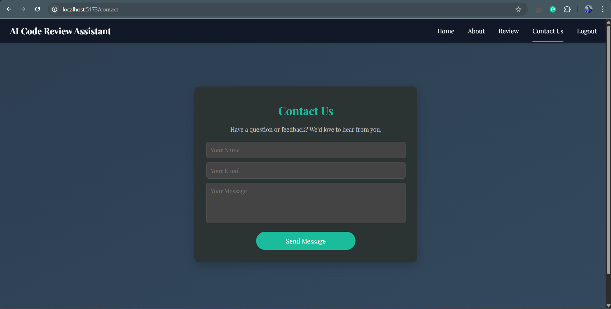
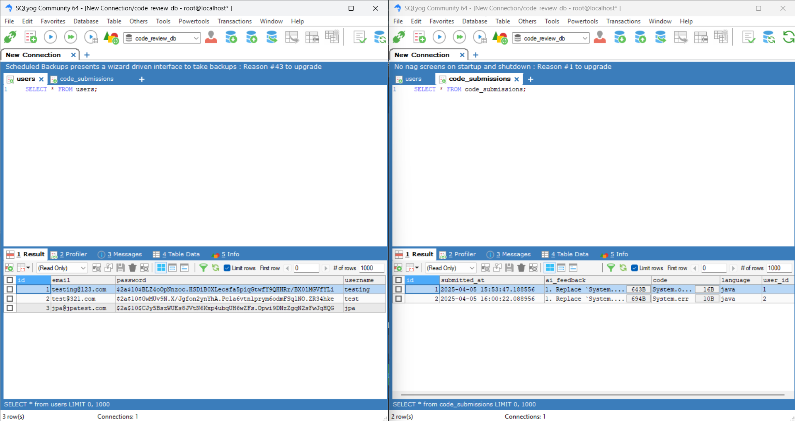
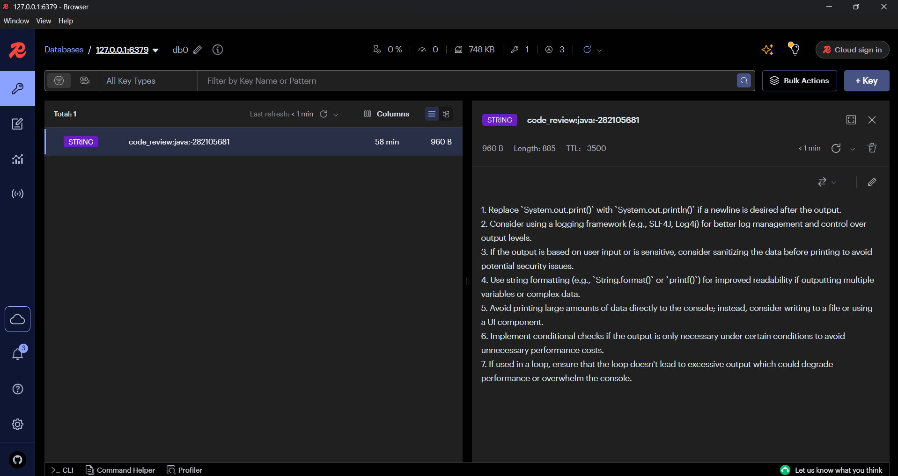
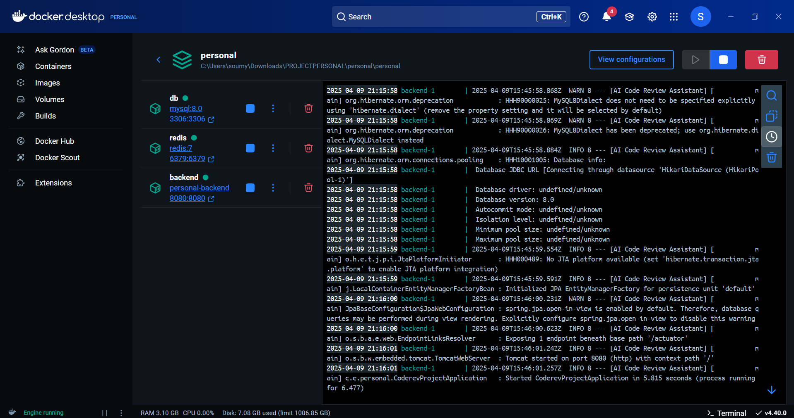

<h1 align="center">AI Code Review Assistant</h1>
<p align="center">
   
</p>
<!-- PROJECT LOGO -->

## 🚀 Overview
This is the **backend** of the Code Review Assistant, a powerful AI-driven system designed to analyze code snippets and provide intelligent feedback. The backend handles API requests, communicates with OpenAI's GPT models, caches responses using Redis, and stores submission data securely.
Here's a link to the frontend of the application: https://github.com/soumyadeep6845/code-review-assistant-frontend

## 🛠 Tech Stack
- **Language:** Java (v17)
- **Framework:** Spring Boot
- **Database:** MySQL
- **API Communication:** REST (Spring MVC)
- **API Documentation:** Swagger (v3)
- **Build Tool:** Gradle
- **Security:** Spring Security
- **Authentication:** JWT (custom, with encryption)
- **Logging:** SLF4j
- **Cache Layer:** Redis
- **Unit Test:** JUnit, Mockito
- **Containerization:** Docker

## 📸 Application Screenshots

### 🔹 Authentication Page


### 🔹 Home Page


### 🔹 About Page


### 🔹 Code Review in Action



### 🔹 API Documentation (Swagger)


### 🔹 Contact Page


### 🔹 MySQL Database (SQLYog)


### 🔹 Local Cache (Redis)


### 🔹 Containerization (Docker) - Backend


---

## 📦 Installation & Setup

### Prerequisites
- Java 17
- MySQL
- Redis
- Gradle
- Docker
- Docker Compose

### 1️⃣ Clone the Repository
```sh
git clone https://github.com/your-username/code-review-assistant-backend.git
cd code-review-assistant-backend
```

### 2️⃣ Set Up Environment Secrets

Create a `secrets.properties` file in the **root directory** of your backend project:

```properties
openai.api.key=<your-openai-api-key>
jwt.secret=<your-jwt-secret>
```

#### 🔑 Generate OpenAI API Key

Generate your OpenAI API key from the [OpenAI website](https://platform.openai.com/).
Copy the output and use it as the **openai.api.key** value in your `secrets.properties` file.

#### 🔐 Generate JWT Secret

To generate a secure JWT secret, open **Windows PowerShell as Administrator** and run the following command:

```powershell
[Convert]::ToBase64String((1..32 | ForEach-Object {Get-Random -Maximum 256}))
```
Copy the output and use it as the **jwt.secret** value in your `secrets.properties` file.

### 3️⃣ Start the Backend (using Docker Compose)

```sh
docker-compose up --build
```
> Note: Starting Redis server and MySQL database separately, is not required. It has already been integrated.
> If still required, run:
> ```
> docker run --name mysql-container -e MYSQL_ROOT_PASSWORD=yourpassword -e MYSQL_DATABASE=code_review -p 3306:3306 -d mysql:latest
> docker run --name redis-container -p 6379:6379 -d redis
> ```
The backend will now be running on **http://localhost:8080**.

---

## 📌 Features

✅ AI-based code analysis using GPT-4o  
✅ Caching of responses using Redis  
✅ RESTful API for frontend communication  
✅ Secure authentication & authorization with JWT  
✅ MySQL database integration  
✅ Containerized using Docker

---

## 📂 Folder Structure

```
code-review-assistant-backend/
│-- personal/
│   │-- src/
│   │   ├── main/
│   │   │   ├── java/com/example/personal/
│   │   │   │   ├── config/         # Configurations
│   │   │   │   ├── controllers/    # API Controllers
│   │   │   │   ├── models/         # Data Models
│   │   │   │   ├── repositories/   # Database Repositories
│   │   │   │   ├── security/       # Security Configuration
│   │   │   │   ├── services/       # Business Logic Services
│   │   │   │   ├── util/           # Helpers & Utilities
│   │   │   ├── resources/
│   │   │       ├── application.properties  # Application Configuration
│   │   ├── test/           # Unit & Integration Tests
│   │-- build.gradle        # Gradle Build Configuration
│   │-- Dockerfile          # Docker Configuration
│   │-- docker-compose.yml  # Docker Compose Configuration
│   │-- secrets.properties  # Key Secrets (to be created separately)
│-- README.md
```

---

## 📜 API Endpoints

### 🔐 Authentication Endpoints (`/auth`)
| Method | Endpoint         | Description                                 |
|--------|------------------|---------------------------------------------|
| POST   | `/auth/register` | Registers a new user                        |
| POST   | `/auth/login`    | Authenticates a user and returns JWT token  |
| GET    | `/auth/verify`   | Verifies the provided JWT token             |

### 🤖 Code Review Endpoints (`/api/code-review`)
| Method | Endpoint                  | Description                          |
|--------|---------------------------|--------------------------------------|
| POST   | `/api/code-review/submit` | Submits code for AI-based review     |

---

## 📌 Deployment

### Build Docker Image

```sh
docker build -t code-review-backend .
docker run -p 8080:8080 code-review-backend
```
> *ℹ️ For local development with Redis and MySQL, it’s recommended to use docker-compose for convenience.*

---

## 🎯 Contribution

If you'd like to contribute, feel free to **fork** the repository, create a **new branch**, and raise a **pull request** with changes you deem necessary!

## 💚 Found this project interesting?

If you found this project useful, then please consider leaving a ⭐ on [GitHub](https://github.com/soumyadeep6845/code-review-assistant-backend). Thank you! 😄

## 👨 Project Maintained By

[Soumyadeep Das](https://www.linkedin.com/in/soumya0021/)

